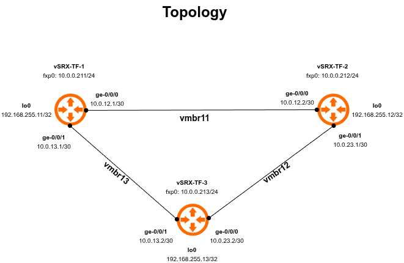

# Juniper vSRX OSPF Lab — Automated with Terraform & Ansible

## Introduction

Network engineering education has traditionally relied on simulation and emulation platforms to provide hands-on experience with routing protocols, security configurations, and network automation. A wide variety of tools exist for this purpose:

| Platform | Type | Notes |
|----------|------|-------|
| Cisco Packet Tracer | Simulator | Cisco-only, free for students |
| GNS3 | Emulator | Supports many vendors including Juniper |
| EVE-NG | Emulator | Enterprise-grade, widely used in labs |
| PNETLab | Emulator | Community-driven EVE-NG alternative |
| Cisco Modeling Labs (CML) | Emulator | Cisco-only, subscription-based |
| Containerlab | Container-based | Modern, lightweight, vendor-agnostic |
| Kathara | Container-based | Academic-focused |
| Mininet | Simulator | Linux-based, OpenFlow/SDN focused |
| Boson NetSim | Simulator | Cisco-focused certification prep |
| netlab | Abstraction layer | Multi-vendor lab automation |
| eNSP | Emulator | Huawei devices only |

The challenge with most of these platforms is their limited support for Juniper Networks devices. GNS3 and EVE-NG are the most popular options that support Juniper vSRX, and while both are capable platforms, they come with trade-offs. Running GNS3 as a cloud service (for example on Google Cloud Platform) and connecting it to the GNS3 desktop client is a viable approach, but introduces network latency, ongoing cloud costs, and stability concerns; devices occasionally disconnect and require reboots, a problem encountered firsthand roughly a year prior to building this lab.

Another important limitation: in a GNS3/EVE-NG environment, NETCONF connectivity to Juniper devices is typically achieved over Telnet rather than SSH, which is not representative of real production automation workflows.

These limitations led to a different approach entirely, building a dedicated home lab on bare metal using Proxmox VE.

---

## The Hardware

This lab runs on a repurposed **Dell Inspiron 7560** laptop running Proxmox VE, giving it a second life as a hypervisor:

| Component | Specification |
|-----------|--------------|
| Processor | 4× Intel Core i7-7500U @ 2.70GHz |
| Memory | 16 GiB RAM |
| Graphics | Intel HD Graphics 620 / NVIDIA GeForce 940MX |
| Storage | 512 GB |
| Hypervisor | Proxmox VE |

### Hardware Constraints

Running Juniper vSRX on this hardware comes with real constraints. The vSRX has minimum requirements of 2 vCPUs and 4 GB RAM per instance. With 15.5 GiB of usable RAM, pushing beyond three instances becomes problematic; running four vSRX instances simultaneously was tested and while technically possible, it drove CPU utilization to nearly 100% and memory usage above 86%. Three instances proved to be the practical sweet spot, keeping resources manageable while still providing a meaningful topology. This shaped the lab design; a triangle of three routers running OSPF Area 0, which is both resource-efficient and rich enough to demonstrate real routing protocol behavior.

Remote access to the lab is handled via **Tailscale**, a zero-configuration VPN that allows secure SSH and API access to Proxmox from anywhere without exposing services to the public internet.

---

## Project Goals

This project set out to accomplish several things simultaneously:

1. Build a functional Juniper vSRX OSPF lab on home hardware
2. Automate the infrastructure provisioning with **Terraform**
3. Automate the JunOS configuration with **Ansible**
4. Demonstrate real network automation workflows using **NETCONF** — the industry-standard protocol for network device management
5. Produce a reusable, documented, GitHub-ready project that reflects professional network automation practices

---

## Network Topology



All three routers run OSPF Area 0 on their data interfaces with loopbacks advertised as passive interfaces. The management interface (`fxp0`) sits on the Proxmox management network (`vmbr0`) and is used exclusively for SSH and NETCONF automation traffic.

---

## Technology Stack

| Layer | Tool | Purpose |
|-------|------|---------|
| Hypervisor | Proxmox VE | VM hosting |
| Infrastructure | Terraform (`bpg/proxmox`) | VM + bridge provisioning |
| Configuration | Ansible (`junipernetworks.junos`) | JunOS automation via NETCONF |
| Connectivity | Tailscale | Secure remote access |
| Protocol | NETCONF (port 830) | Industry-standard network management |
| Routing | OSPF Area 0 | Dynamic routing between vSRX instances |

---

## How It Works

### Phase 1 — Infrastructure Provisioning (Terraform)

Terraform provisions the entire Proxmox infrastructure from scratch:

- Three Linux bridges (`vmbr11`, `vmbr12`, `vmbr13`) for inter-router links
- Three vSRX virtual machines (VMIDs 211–213) with correct CPU, memory, disk, and NIC assignments
- An Ansible inventory file (`hosts-tf.ini`) generated automatically from a template

```bash
cd terraform
terraform init
terraform plan
terraform apply
```

### Phase 2 — Bootstrap (Manual, One-Time)

This is the one step that cannot be automated without Zero Touch Provisioning (ZTP) infrastructure. A freshly provisioned vSRX has no SSH user, no NETCONF service, and no management IP configured; Ansible cannot reach it until these basics are in place.

For each router, a minimal bootstrap is applied via the Proxmox serial console (`qm terminal`):

```junos
configure
set system host-name vsrx-tf-1
set system root-authentication plain-text-password
set system login user labuser class super-user authentication plain-text-password
set system services ssh
set system services netconf ssh
set interfaces fxp0 unit 0 family inet address 10.0.0.211/24
commit
```

This is a known and accepted step in network automation workflows. Even in production environments, some form of initial bootstrap is required before automation can take over; whether via ZTP, DHCP options, or cloud-init equivalents.

### Phase 3 — Configuration (Ansible)

Once the routers are reachable via NETCONF, Ansible takes over and applies the full configuration using three roles:

```bash
cd ansible
ansible-playbook -i inventory/hosts-tf.ini site-tf.yml
```

**Role: base**
- Hostname configuration
- NTP server (Google Public NTP)
- DNS name servers
- Security policy (trust-to-trust permit)

**Role: interfaces**
- Interface IP addressing
- Interface descriptions
- Security zone interface assignments and definitions with SSH and NETCONF host-inbound-traffic

**Role: ospf**
- OSPF Area 0 configuration
- Loopback advertised as passive interface
- Security zone configuration for ospf

---

## Key Technical Challenges & Solutions

### 1. NETCONF via ProxyCommand

The Proxmox host sits behind Tailscale and the vSRX routers are only reachable via the Proxmox host as a jump server. Both `ncclient` (used by PyEZ) and Ansible's NETCONF connection plugin need to tunnel through this jump host.

**The problem:** `ProxyJump` directives in `~/.ssh/config` are ignored by `ncclient`. Only `ProxyCommand` works reliably.

**The solution:** Use `ProxyCommand ssh -W %h:%p proxmox` in `~/.ssh/config` and reference routers by **hostname** (not IP) in Ansible inventory. When Ansible uses hostnames, it looks up the SSH config and picks up the ProxyCommand automatically. Using IPs bypasses `~/.ssh/config` entirely.

```
# ~/.ssh/config
Host proxmox
    HostName <tailscale-ip>
    User <tailscale-ip> // Default root
    IdentityFile ~/.ssh/id_ed25519
    ServerAliveInterval 30
    ServerAliveCountMax 10
    TCPKeepAlive yes
    StrictHostKeyChecking no
    UserKnownHostsFile /dev/null

Host vsrx-*
    User labuser
    IdentityFile ~/.ssh/id_ed25519
    ProxyCommand ssh -W %h:%p proxmox
    StrictHostKeyChecking no
    UserKnownHostsFile /dev/null

Host vsrx-tf-1
    HostName 10.0.0.211
Host vsrx-tf-2
    HostName 10.0.0.212
Host vsrx-tf-3
    HostName 10.0.0.213
```

### 2. Terraform SSH for Disk Import

The `bpg/proxmox` Terraform provider requires SSH access to Proxmox (in addition to the API) to import disk images into VMs. This SSH connection also does not honor `~/.ssh/config` — it requires explicit configuration via the provider's `node` block and the SSH key must be loaded into `ssh-agent`.

```hcl
ssh {
  agent    = true
  username = var.proxmox_username
  node {
    name    = var.proxmox_node
    address = var.proxmox_address  # Tailscale IP
  }
}
```

### 3. vSRX Disk Size

The vSRX qcow2 image has a virtual size of 18,440 MiB. Terraform's disk `size` parameter must be set to a value **greater than or equal to** the image's virtual size; attempting to set a smaller value results in a "shrinking disks is not supported" error. Setting `size = 19` (GiB) resolves this.

### 4. vSRX Security Zones and NETCONF

Unlike most Linux-based VMs, the vSRX enforces its security zone policy even for management traffic on data interfaces. OSPF adjacencies and NETCONF sessions on `ge-0/0/x` interfaces require explicit `host-inbound-traffic` configuration within the security zone.

### 5. Credentials and Secret Management

Sensitive values are handled at two layers:

- **Ansible:** `group_vars/juniper.yml` is encrypted with Ansible Vault and also excluded from git via `.gitignore`
- **Terraform:** `terraform.tfvars` contains API tokens and addresses and is excluded from git via `.gitignore`

Both projects include `.example` files showing the required structure without exposing actual credentials.

---

## Project Structure

```
juniper-ospf-lab-ansible-terraform/
├── ansible/
│   ├── ansible.cfg
│   ├── site-tf.yml
│   ├── inventory/
│   │   └── hosts-tf.ini          # Auto-generated by Terraform
│   ├── group_vars/
│   │   ├── juniper.yml           # Encrypted with Ansible Vault
│   │   └── juniper.yml.example
│   ├── host_vars/
│   │   ├── vsrx-tf-1.yml
│   │   ├── vsrx-tf-2.yml
│   │   └── vsrx-tf-3.yml
│   └── roles/
│       ├── base/
│       ├── interfaces/
│       └── ospf/
├── terraform/
│   ├── versions.tf
│   ├── main.tf
│   ├── variables.tf
│   ├── outputs.tf
│   ├── inventory.tpl             # Template for Ansible inventory
│   ├── terraform.tfvars.example
│   └── terraform.tfstate         # gitignored
├── docs/
│   └── topology.png
└── README.md
```

---

## Prerequisites

### Software

- Terraform >= 1.0
- Ansible >= 2.14
- Python 3.x with `ncclient` installed
- `junipernetworks.junos` Ansible collection
- Tailscale (for remote access)

### Installation

```bash
# Install Ansible collection
ansible-galaxy collection install junipernetworks.junos

# Install ncclient
pip install ncclient --user

# Install Terraform (Fedora/RHEL)
sudo dnf install -y dnf-plugins-core
sudo dnf config-manager addrepo --from-repofile=https://rpm.releases.hashicorp.com/fedora/hashicorp.repo
sudo dnf install terraform -y
```

### Setup

**1. Clone the repository**
```bash
git clone https://github.com/Elikyals/juniper-ospf-lab-ansible-terraform.git
cd juniper-ospf-lab-ansible-terraform
```

**2. Configure SSH jump host**

Add to `~/.ssh/config`:
```
Host proxmox
    HostName <proxmox-tailscale-ip>
    User root
    IdentityFile ~/.ssh/id_ed25519
    ServerAliveInterval 30
    ServerAliveCountMax 10
    TCPKeepAlive yes
    StrictHostKeyChecking no
    UserKnownHostsFile /dev/null

Host vsrx-tf-*
    User labuser
    IdentityFile ~/.ssh/id_ed25519
    ProxyCommand ssh -W %h:%p proxmox
    StrictHostKeyChecking no
    UserKnownHostsFile /dev/null


Host vsrx-tf-1
    HostName 10.0.0.211
Host vsrx-tf-2
    HostName 10.0.0.212
Host vsrx-tf-3
    HostName 10.0.0.213
```

**3. Configure Terraform credentials**
```bash
cp terraform/terraform.tfvars.example terraform/terraform.tfvars
nano terraform/terraform.tfvars  # Add your Proxmox API token and Tailscale IP
```

**4. Configure Ansible credentials**
```bash
cp ansible/group_vars/juniper.yml.example ansible/group_vars/juniper.yml
nano ansible/group_vars/juniper.yml  # Add labuser password
ansible-vault encrypt ansible/group_vars/juniper.yml
```

---

## Running the Lab

### Step 1: Provision Infrastructure

```bash
cd terraform
eval $(ssh-agent) && ssh-add ~/.ssh/id_ed25519
terraform init
terraform apply
```

### Step 2: Bootstrap Routers (One-Time)

For each router via Proxmox console (`qm terminal 211`, `qm terminal 212`, `qm terminal 213`):

```junos
configure
set system host-name vsrx-tf-1
set system root-authentication plain-text-password
set system login user labuser class super-user authentication plain-text-password
set system services ssh
set system services netconf ssh
set interfaces fxp0 unit 0 family inet address 10.0.0.211/24
commit
```

Adjust hostname and IP for each router. Exit console with `Ctrl+]`.

### Step 3: Configure JunOS

```bash
cd ansible
ansible-playbook -i inventory/hosts-tf.ini site-tf.yml --vault-password-file ~/.vault_pass
```

### Verification

```bash
# Check OSPF neighbors
ansible juniper -i inventory/hosts-tf.ini \
  -m junipernetworks.junos.junos_command \
  -a "commands='show ospf neighbor'"

# Check routing table
ansible juniper -i inventory/hosts-tf.ini \
  -m junipernetworks.junos.junos_command \
  -a "commands='show route'"
```

### Teardown

```bash
cd terraform
terraform destroy
```

---

## Future Improvements

Several enhancements would make this lab more complete and production-representative:

**Zero Touch Provisioning (ZTP)**
Eliminating the manual bootstrap step is the most impactful improvement. A DHCP/TFTP server on the management network could serve a minimal JunOS configuration to freshly booted vSRX instances, making the entire workflow fully automated from `terraform apply` to a configured router.

**Multi-Area OSPF**
Extending the topology to include multiple OSPF areas (Area 0 as backbone with stub areas) would demonstrate more realistic enterprise routing designs and allow exploration of area border router (ABR) configuration.

**OSPF Authentication**
Adding MD5 or SHA authentication to OSPF adjacencies would demonstrate security hardening of the routing protocol; a standard requirement in production environments.

**BGP Integration**
Adding an iBGP or eBGP session between routers would significantly expand the routing protocol coverage and allow exploration of route policy and communities.

**Ansible for Backup & Compliance**
Adding playbooks that capture `show configuration` output and save it to version control would demonstrate configuration backup automation; a common real-world use case.

**Molecule Testing**
Adding Molecule test cases to the Ansible roles would enable automated validation of role behavior, making the project more robust and portfolio-worthy.

**Terraform Remote State**
Moving Terraform state to a remote backend (such as an S3-compatible store) would make the project more collaborative and eliminate the risk of state file loss.

---

## License

MIT-0 — Free to use, modify, and distribute without attribution required.